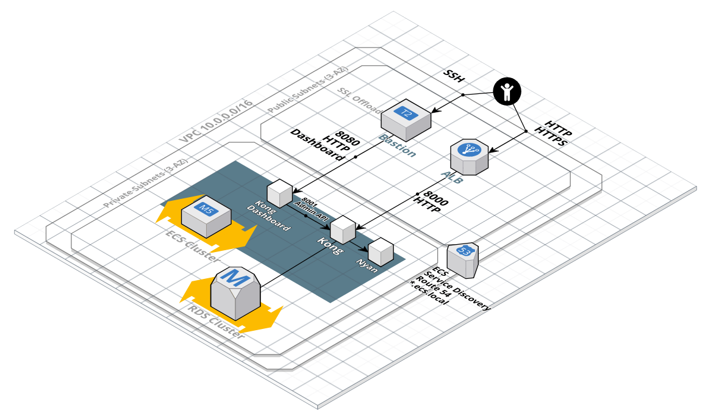

# Overview

Deploy [Kong](https://konghq.com/kong-community-edition/) to AWS in DB-less mode (no postgresql and no cassandra)

# Disclaimer (How this code came to be)
Once I received the code challenge, I started googling and found the architecture of Kong on AWS ECS is fairly basic. I stumbled upon [this article](https://medium.com/@nick.p.doyle/deploying-kong-to-aws-elastic-container-service-with-terraform-9de83d7e21) by [Nick Doyle](https://bitbucket.org/%7B5d0aaa3a-ab6b-4079-8249-6632d8831d28%7D/) that explained how to deploy Kong on AWS ECS. I thought it would be a good chance to learn terraform because I've never used it so far and it would be easier than using Cloudformation alone or Cloudformation with say Ansible and Make.
Most of the code was done by [Nick Doyle](https://bitbucket.org/%7B5d0aaa3a-ab6b-4079-8249-6632d8831d28%7D/) I forked the code or rather duplicated it because it was on bitbucket, thought it should just work (famous last words :D) anyway after cleaning up syntax conflicts with the current terraform version and fixing terraform validation errors, I found that the Kong service on ECS along with the Dashboard never worked so I decided to remove some of the elements of the architecture to simplify the task and be able to deliver in time since you guys emphasized "no gold plating" so here is what I did

1. The Original author designed this so that the Kong container would lookup secrets from SSM during startup and since this wasn't working I removed SSM secrets and added them as env vars in the task definition directly
2. The original solution had a postgresql RDS instance, this is also added complexity and takes a lot of time to provision and since Kong can be started in db-less mode I went ahead and removed this.
3. Bastion hosts: Decided to remove bastion hosts because 
   1. I can use session manager to login to ECS hosts directly
   2. for the purpose of this code challenge it doesn't really prevent me from exposing Kong on the internet so tunneling through bastion isn't needed in the first place
4. Kong Dashboard this is also not required in the challenge, would've been a nice to have if it worked out of the box

# What I have Improved over the already existing code
1. Removed git submodules
2. Fixed syntax errors with the latest Terraform version
3. Fixed Tasks not sending logs to Cloudwatch
4. Kong actually runs

# What I would have done if I had more time
1. Add Tag and Drain Lambdas to hookup ECS with Autoscaling properly to prevent service outages during autoscaling events
2. Add an RDS/DB container instead of running "DB-less" mode
3. Used IAM authentication for Kong's access to RDS instead of managing secrets
4. Secure Access and lock everything down SG, no public access to Kong
5. clean up the code and use modules more
6. Added a simple Makefile to build and push the container image
7. Mount a Volume for Kong since it's in db-less mode
8. Test Curl commands on the admin API, still fiddling with ports and haven't found a fix
9. Actually enroll an API in Kong

# What I've failed at so far
1. Get Kong to start in DB-less mode with both a mounted volume and a config file, can only do one of those atm
   1. If I create the file on the container and get a host directory or a docker volume mounted on that directory inside the container the file goes away which is the way linux volume mounting works
   2. If I create the file on the container and get the entry point script to copy it over to the mount point inside the container which supposedly would've been created before the container started it doesn't work
   3. If I create a mount point on the ecs host and create the file in it using the  instance/LC userdata and then mount that mountpoint to the target one inside the kong container using the task definition, this also doesn't work.
2. Enrolling an API in kong

# Deployment Instructions

1. Clone this repo
2. [Install terraform](https://www.terraform.io/intro/getting-started/install.html)
3. Update variables.tf according to your environment
4. Create an ssh key for bastion and ECS instances if it doesn't exist with the name you specify [here](https://github.com/mdesouky/AWS-Kong-ECS/blob/master/variables.tf#L7-L9)
5. `terraform init`
6. `terraform apply`

# Functionality

## ECS Services

- Kong Gateway
    - port 8000 (standard API Gateway) open from ALB and Bastion (kong.ecs.local)
    - port 8001 (admin API) open from Kong Dashboard container
- Kong Dashboard
    - connects to kong ADMIN API port 8001
    - port 8080 (standard HTTP interface) open from Bastion (kong-dash.ecs.local)
- Nyan
    - shows nyan cat
    - port 80 open from Kong Gateway (nyan.ecs.local)

### Registry & Source

The container is hosted on [Docker Hub](https://hub.docker.com/r/mdesouky/kong), and the source on [Github](https://github.com/mdesouky/AWS-Kong-ECS/blob/master/Dockerfile)

## Done

- VPC
    - Subnets public & private in 3AZs
- SGs for
    - Kong app (on ecs)
    - RDS, inbound only from public subnet (issues getting TF to do by SG)
- IAM roles for
    - ECS instance
    - ECS service (the running containers themselves, with only SSM read)
- ECS Cluster
    - ASG & LC
    - ECS Instances restricted according to best prac - no privileged containers & no metadata from containers
- ECS Service for Kong
    - TODO rds access
- Load Balancer
- ECS Service Discovery

#

# References:
1. [Nick Doyle's Post on Medium](https://medium.com/@nick.p.doyle/deploying-kong-to-aws-elastic-container-service-with-terraform-9de83d7e21)
2. [Nick Doyle's Repo on Bitbucket](https://bitbucket.org/nick_doyle/kong_aws_terraform/src/master/)
3. [Terraform AWS Modules](https://github.com/terraform-aws-modules)

